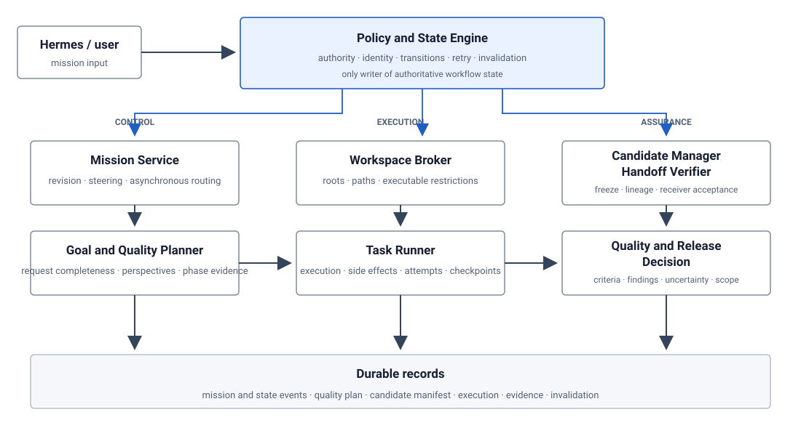
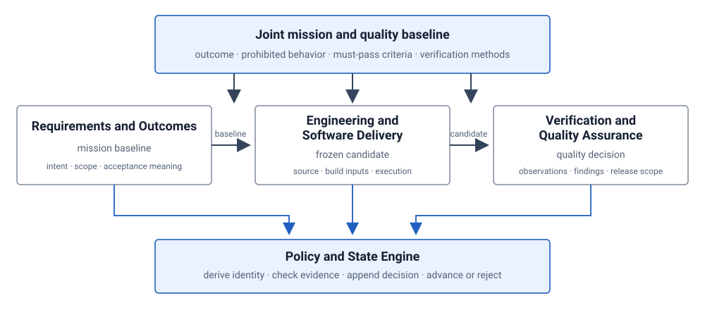
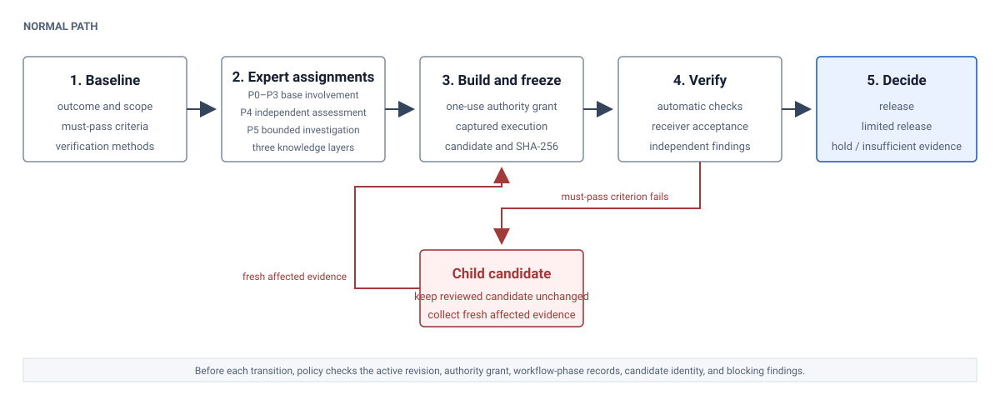

# Evidence-Based Multi-Agent Software Development Harness

> **Architecture guide**
>
> This guide explains the target operating model through one mission. It is not an implementation-status report, a release claim, or a substitute for approved requirements and decision records. Linked deep dives preserve the complete state, event, schema, and source-attribution detail.

An agent's completion claim is not evidence. The architecture below places identity, authority, state transitions, artifact binding, independent judgment, and release behind a policy boundary.

<figure class="architecture-figure">
  <div class="figure-scroll"></div>
  <figcaption><strong>Figure 1. System boundary and logical responsibilities.</strong> The Candidate Manager, Handoff Verifier, and Quality and Release Decision are logical responsibilities, not required deployment units. Blue paths show policy control; dark paths carry work and evidence.</figcaption>
</figure>

## How to read this document

- **Purpose and Scope** explains why the harness is needed and what it promises.
- **Architecture at a Glance** gives the smallest useful system picture.
- **Core Concepts and Operating Model** defines the concepts and decision rights.
- **Worked Mission: `export-ownership`** follows one request to a verified release.
- **Runtime Architecture** maps the same steps to logical components.
- **Reliability and Recovery** adds interruption, retry, and external operations with uncertain outcomes.
- **Trust Boundaries** separates target enforcement from external controls.
- **Prior Work** explains established methods and the harness-specific synthesis.
- **Reference and Next Reading** links deep dives, normative material, and role-specific paths.

Read sections 1 through 7 in order on a first pass. Sections 8 and 9 provide design context and lookup paths. Each chapter links to the detailed source material that it intentionally leaves out.

## 1. Purpose and Scope

> **Audience:** Software and systems engineers, mission designers, reviewers, and operators who need to understand the target architecture before reading schemas or implementation code.

An LLM agent can say that it wrote code, ran tests, reviewed a change, or completed a task. Those statements do not establish what ran, which files were examined, whether the reviewed material changed, or whether the result is acceptable for its intended use.

The harness addresses that gap. It treats model output as an untrusted proposal or observation and places authority, state changes, artifact identity, and release decisions behind deterministic checks.

### 1. Ordinary failure modes

Five ordinary failures define the problem:

1. A worker reports that tests passed without captured execution evidence.
2. A reviewer examines files while the producer continues to edit them.
3. A late result from an older revision is attached to the current mission.
4. A caller labels itself `qa` and approves its own output.
5. An external write may have succeeded, but a lost response causes a retry to repeat the side effect.

Another model can repeat a claim or role name. It cannot reconstruct missing observations, freeze a shared directory, derive acting identity from an issued authority grant, or reveal an external system's state.

### 2. Assurance target

For each mission, policy must answer one bounded question:

> Does the evidence for this exact mission revision and frozen candidate satisfy every must-pass acceptance criterion and support the declared release scope?

Policy keeps the accepted baseline, issued authority grant, frozen candidate, observations, and release decision distinct until all required bindings and criterion results pass. Given those same inputs, changing the worker does not change the evidence or decision rules required to advance.

### 3. Applicable use

The harness is appropriate when work will be released, published, submitted as evidence, resumed after interruption, or reviewed under separation-of-responsibility requirements. A low-risk change may use fewer experts and observations, but it still needs an explicit revision, bounded authority, an unchanged review target, fresh evidence, and a recorded decision.

### 4. Limits

This guide defines a target operating model; it does not certify the current Python implementation. The target does not claim total correctness, complete operating-system isolation, exactly-once behavior in another system, independence created only by different prompts, or conformance to a cited standard. Higher-risk deployments require external operating-system, credential, network, build, and release controls.

**Next:** [Architecture at a Glance](architecture-at-a-glance.md) gives the smallest useful picture of the system. The detailed [purpose and assurance scope](purpose-and-scope.md) preserves the protected items, observable failure conditions, mission types, and complete non-goals.


## 2. Architecture at a Glance

> **This chapter explains:** the system boundary, the normal mission path, and the few records that make later decisions reviewable.

The harness is a policy-controlled path from user intent to a release decision. Models and tools may propose work, produce artifacts, run checks, and report observations. They do not assign their own authority or change authoritative workflow state.

### 1. System boundary

Figure 1 at the start of this guide shows logical responsibilities, not a required deployment topology. The Policy and State Engine is the single transition boundary. Control, execution, and assurance responsibilities append durable records that policy checks before accepting a transition.

Three rules make the picture useful:

- **Control is distinct from work.** The Mission Service and Goal and Quality Planner prepare requests and plans; policy decides whether they may advance.
- **Execution is distinct from judgment.** The Workspace Broker and Task Runner produce captured work; Candidate, Handoff, Quality, and Release responsibilities determine what can be judged and released.
- **Records are distinct from assertions.** A worker response can point to a record, but it cannot replace the record or set its validity.

### 2. One mission path

The documentation uses one scenario throughout:

> **`export-ownership`:** Add an authenticated data-export feature that returns only records owned by the requesting account.

The normal path has nine stable steps. Later chapters add runtime components and failure handling to these same steps instead of introducing another example.

1. Record the request and create an active mission revision.
2. Accept the outcome, forbidden behavior, acceptance criteria, and required observations as the mission and quality baseline.
3. Enumerate required perspectives and assign compatible work without combining conflicting authority.
4. Issue a one-use authority grant for one task attempt, identity, workspace, and set of operations.
5. Run approved work and capture outputs, hashes, checkpoints, and external-operation records.
6. Bind every decision-relevant input to an immutable candidate with parent-child lineage.
7. Check the structured handoff and obtain receiver acceptance.
8. Rerun required checks against the frozen candidate and record criterion results.
9. Decide supported release scope and, when permitted, package only the approved candidate.

A failed must-pass acceptance criterion does not edit the reviewed candidate. Policy holds the mission, Engineering creates a child candidate, affected evidence becomes `STALE`, and QA makes a new decision from fresh affected observations.

### 3. Authoritative records

Four record groups prevent one successful action from implying that the entire mission is complete. The mission and quality baseline establish what must be true, not that implementation exists. Authority, task, attempt, and execution records establish who could act and what the runner observed, not fitness for release. Candidate, manifest, handoff, and evidence records establish the exact material and observations under judgment, not that every criterion passed. Quality, package, and release records establish the supported scope and residual risk, not correctness outside the declared and observed boundary.

### 4. Failure containment

The same structure answers the five failures from the opening chapter:

- captured execution replaces unsupported completion claims;
- a frozen candidate prevents in-place changes during review;
- revision and candidate bindings reject stale results;
- an issued authority grant replaces caller-supplied role identity;
- stable external-operation identity and reconciliation prevent automatic replay after an unknown outcome.

These mechanisms do not make models or external systems trustworthy. They make the evidence and decision boundary explicit enough to reject unsupported progress.

**Next:** [Core Concepts and Operating Model](operating-model-overview.md) defines the nouns and decision rights used by the worked mission. For deployment-neutral component and state details, use the [runtime deep dive](runtime.md).


## 3. Core Concepts and Operating Model

> **This chapter explains:** the stable concepts, responsibility separation, and planning decisions needed to read the worked mission.

### 1. Core concepts

| Concept | Meaning in this architecture |
|---|---|
| **Mission** | A bounded user outcome whose work, evidence, and decisions share one identity. |
| **Revision** | One accepted interpretation of the mission. An acceptance-changing instruction creates a new revision rather than rewriting the old one. |
| **Task** | A logical unit of work in the workflow plan. |
| **Attempt** | One execution of a task under one authority grant and retry budget. A retry creates a new attempt, not a new logical task. |
| **Authority grant** | An issued, bounded record that establishes acting identity and permitted operations for a specific mission, revision, workflow phase, task, attempt, workspace, and candidate when applicable. |
| **Candidate** | An immutable verification unit that binds the work product and every decision-relevant input to one identity. It is not a person or a mutable directory. |
| **Evidence** | A checked artifact, execution record, observation, handoff decision, or finding whose dependencies and identity are explicit. |
| **Quality decision** | A candidate-bound result for each must-pass acceptance criterion plus the supported release scope, uncertainty, and residual risk. |


<figure class="architecture-figure">
  <div class="figure-scroll"></div>
  <figcaption><strong>Figure 2. Responsibility and decision flow.</strong> The three areas plan jointly, but Engineering delivers the candidate and QA evaluates it independently. Only the Policy and State Engine can change authoritative workflow state.</figcaption>
</figure>

### 2. Areas of responsibility

The three areas define quality together, then remain separate where combining authority would undermine the decision.

- **Requirements and Outcomes** defines the intended result, scope, forbidden behavior, scenarios, and what acceptance means. It cannot declare its own requirements satisfied.
- **Engineering and Software Delivery** designs and builds a reproducible candidate. It cannot modify independently controlled expected results or decision rules, approve the candidate, or edit a candidate under review.
- **Verification and Quality Assurance** determines what the frozen candidate demonstrates and whether the observations support the intended use. It cannot modify the candidate or invent missing execution evidence.

The **Mission Manager** coordinates workflow phases, dependencies, disputes, resources, and transition requests. It does not implement work, perform final quality judgment, or change state. The **Policy and State Engine** is the only authority that may accept a transition and derive the next authoritative state.

### 3. Joint quality planning

Before Engineering receives write authority, the three areas establish:

- intended outcome, scope, and forbidden behavior;
- must-pass acceptance criteria and improvement targets;
- required perspectives and verification methods;
- independently controlled expected results and decision rules;
- required inputs, outputs, observations, and handoff material;
- assumptions that would reopen the baseline.

A must-pass acceptance criterion succeeds or fails independently. Performance, usability, or reviewer enthusiasm cannot offset a confirmed authorization, integrity, security, or required-functionality failure.

### 4. Participation profile

The planner enumerates perspectives before deciding how many experts or agents to use. Participation has three independent fields:

```text
delivery_depth: P0 | P1 | P2 | P3
independent_assessment_required: true | false
bounded_investigation_required: true | false
```

`P0` through `P3` describe the base level of involvement: deterministic enforcement, routine coverage by an assigned expert, consultation at defined decision points, or continuous participation throughout a workflow phase. Independent assessment and bounded investigation are separate conditions. Display forms such as `P3+P4`, `P2+P5`, and `P2+P5+P4` are shorthand; P4 and P5 are not higher ranks than P3.

Perspectives may share an expert only when their responsibility, knowledge, workflow phase, and quality objectives are compatible. Implementation remains separate from final judgment, and implementation remains separate from control of the independently controlled expected results and decision rules used to evaluate it.

### 5. Handoff and decision rights

A handoff advances only after two decisions:

1. automatic checks confirm schema, identity, required material, regular-file status, permitted paths, SHA-256 values, lineage, and producer authority;
2. the receiver confirms that the material is understandable, complete enough, and usable without recreating the previous work.

A structurally valid but unusable handoff does not pass. A persuasive explanation with missing files or incorrect hashes also does not pass.

Policy owns state transitions and candidate identity. Engineering owns design and implementation within issued authority. QA owns findings and final quality judgment under separate authority. Packaging receives an approved candidate and evidence set but cannot edit source or acceptance material.

**Next:** [Worked Mission: `export-ownership`](worked-mission-overview.md) applies these concepts to one request. The [operating-model deep dive](operating-model.md) contains the complete perspective inventory, participation rules, research escalation, and decision-rights table.


## 4. Worked Mission: `export-ownership`

> **This chapter explains:** how one request becomes a frozen candidate, why the first candidate is held, and how a corrected child candidate reaches release.

> **Reading note:** This is an illustrative execution of the target architecture. It does not claim that the current Python package implemented the feature or produced the symbolic records used below.

### 1. Scenario and acceptance boundary

The user asks:

> Add an authenticated data-export feature that returns only records owned by the requesting account.

The Mission Service records `mission-export-ownership` and creates `revision-0001`. Before implementation, the baseline resolves what counts as the requesting account, which records and formats are supported, how temporary export material is retained, and which storage modes are in scope.

The release boundary includes five must-pass conditions:

- an authenticated account receives only its own records;
- unauthenticated and cross-account requests fail before material is exposed;
- required owned records are complete and not duplicated;
- every declared configuration completes as specified;
- every asynchronous export operation has a known outcome, and every resulting external side effect is tracked.

Usability and performance remain improvement targets unless the accepted baseline promotes them to must-pass acceptance criteria. They cannot offset a security or data-integrity failure.


<figure class="architecture-figure">
  <div class="figure-scroll"></div>
  <figcaption><strong>Figure 3. Life of the worked mission.</strong> Each transition requires the specified records. A failed must-pass acceptance criterion leaves the reviewed candidate unchanged and sends correction to a child candidate.</figcaption>
</figure>

### 2. Walkthrough

The same nine steps introduced in the system overview carry the mission from request to release.

1. **Create the revision.** The planner determines whether the request is specific enough to choose a development path and verify the result. Acceptance-changing steering creates another revision.
2. **Accept the quality baseline.** Requirements defines ownership and forbidden disclosure; Engineering identifies the authorization and storage boundaries; QA defines independent ownership fixtures, negative cases, and required observations.
3. **Assign the required expertise.** The authorization perspective requires continuous expert participation and independent assessment. The perspective on storage semantics can trigger a bounded investigation when documentation and existing evidence do not answer a release-relevant question.
4. **Issue bounded authority.** Engineering receives a one-use authority grant for one task attempt, approved workspace, allowed operations, and approved tools. A submitted role name cannot expand it.
5. **Execute and capture.** The runner records the executable, arguments, bounded environment, exit status, output, produced files, checked SHA-256 values, checkpoints, and external-operation IDs.
6. **Freeze candidate `C1`.** The Candidate Manager binds source, requirements, independently controlled expected results and decision rules, build settings, dependencies, and toolchain identity to one immutable manifest. Verification cannot edit this material.
7. **Accept the handoff.** Automatic checks validate identity, lineage, paths, regular files, and hashes. The independent verifier separately confirms that the handoff is understandable and usable.
8. **Verify `C1`.** QA reruns the required checks in a read-only workspace, compares observations with independently controlled expected results and decision rules, and records criterion results for `C1`.
9. **Decide and package.** Policy accepts a release decision only when every required observation belongs to the active revision and candidate and no blocker remains. Packaging can use only the approved candidate and evidence set.

### 3. From `C1` to `C2`

QA finds that a secondary download route accepts an account ID from the request and bypasses the authenticated ownership filter.

1. QA records a reproducible authorization finding for `C1`.
2. The security acceptance criterion fails, and the mission is held.
3. `C1` remains unchanged.
4. Engineering receives a correction-only authority grant and creates child candidate `C2` with `C1` as parent.
5. Evidence that depends on the changed authorization path becomes `STALE`.
6. Automatic handoff checks and receiver acceptance run again for `C2`.
7. QA receives a new read-only authority grant, reruns every affected case, and records fresh observations for `C2`.
8. After every applicable must-pass acceptance criterion passes independently, the new quality decision records `RELEASE` for `C2`.
9. Policy makes `C2` `PACKAGE_ELIGIBLE`; packaging produces `PKG2` from the exact `C2`, `QD2`, and `ES2` identities.

The original hold and stale decisions remain in the history. A change from individual ownership to organization-wide ownership would create `revision-0002`, not merely another child candidate, because it changes the meaning of acceptance.

### 4. Observable decision chain

| Decision point | Required material | Result in this mission |
|---|---|---|
| Baseline acceptance | Contributions from all three areas, quality profile, methods, and open assumptions | `revision-0001` can enter execution |
| Candidate freeze | Complete input manifest, checked bytes, toolchain identity, and lineage | `C1`, then child `C2` |
| Handoff acceptance | Automatic identity and file checks plus receiver acceptance | QA may begin read-only verification |
| Criterion decision | Independent observations and findings bound to one candidate | Authorization fails for `C1`; affected checks pass for `C2` |
| Release and package | Complete valid evidence set, no unresolved blocker, exact candidate binding | `QD2=RELEASE`, `C2:PACKAGE_ELIGIBLE`, `PKG2:CREATED` |

No transition succeeds merely because a payload names the expected role, state, or result.

**Next:** [Runtime Architecture](runtime-overview.md) shows which logical components enforce each step. The [complete worked-mission trace](worked-mission.md) preserves the authority records, manifest derivation, rejection cases, and `event-0001` through `event-0035` for readers auditing causal closure.


## 5. Runtime Architecture

> **This chapter explains:** which logical components enforce the worked mission and how control records, work products, and evidence move through the system.

The components below are logical responsibilities, not a requirement to deploy separate services. The target can begin as one Python package and Hermes plugin surface, provided that lower-level calls cannot bypass the same policy checks.

### 1. Component collaboration

The **Mission Service** preserves the active instruction, creates revisions, routes late asynchronous results, and identifies records affected by steering. The **Goal and Quality Planner** decides whether the request is specific enough to plan, enumerates perspectives, assigns participation requirements, and defines required inputs, outputs, and observations.

The **Policy and State Engine** derives acting identity from an issued authority grant and rejects a mismatched mission, revision, task, attempt, workspace, tool, candidate, or operation. The **Workspace Broker** and **Task Runner** then restrict roots and executable identities, run approved work, and capture outputs, hashes, checkpoints, and external-operation records.

The **Candidate Manager** normalizes paths, rejects prohibited symbolic links, calculates the manifest identity, records lineage, and freezes the review target. The **Handoff Verifier** performs automatic structure and identity checks before the receiving expert records receiver acceptance. Authorized QA reruns required methods through the **Task Runner**, and the **Quality and Release Decision** responsibility evaluates each criterion, uncertainty, blocker, and supported release scope. Policy permits packaging only from the approved candidate and evidence set.

### 2. Control and data flow

Workers submit artifacts, observations, findings, or transition requests. They never write authoritative state directly.

Every protected request follows the same sequence:

```text
load issued authority grant
  → derive acting identity
  → compare mission, revision, workflow phase, task, attempt, workspace, candidate, and operation
  → load authoritative state and the required evidence set
  → validate required inputs, outputs, paths, files, SHA-256 values, and producer identity
  → evaluate blockers, criterion results, external-operation state, and receiver acceptance
  → append one accepted, rejected, returned, or held decision
  → derive the next state from accepted events
```

This boundary separates **control flow** from **data flow**. Control flow authorizes work and accepts or rejects state changes. Data flow carries source, manifests, fixtures, execution output, findings, receipts, and packages. A component may handle both types internally, but it must not treat receipt of data as permission to advance.

### 3. Durable record groups

Mission and state records answer what changed, under which authority, and why. Plan and quality records state what had to be true. Candidate and lineage records identify the exact material under judgment. Evidence and release records connect commands, outputs, observations, findings, handoff decisions, criterion results, package identity, and supported scope.

These records may share a data store. Their validation rules and decision meanings remain separate, so the existence of an execution record cannot imply a quality decision and a quality decision cannot imply that package bytes exist.

### 4. State ownership and invalidation

Mission intent, tasks, attempts, candidates, evidence, external side effects, and release decisions change for different reasons. The architecture therefore does not compress the entire mission into one status string.

- A retry creates a new attempt while preserving the logical task and earlier attempt history.
- Candidate correction creates a child candidate; it does not edit the frozen parent.
- Evidence becomes `INVALID` when it never passed its checks and `STALE` when a later accepted change removes its applicability.
- `QUALITY_DECIDED` means that criterion results and release scope were accepted; it does not mean that a package exists.
- `PACKAGE_ELIGIBLE` permits a package task but does not itself create package bytes.
- A later valid finding can append a completion invalidation and reopen the earliest affected workflow phase without erasing the earlier release decision.

### 5. External operations

An external operation is a stable logical request that can span several attempts. An external side effect is the actual change in the external system. The operation identity remains stable across retries; the attempt identity remains in the execution history.

If a response is lost after a possible write, policy records an unknown outcome and forbids replay until reconciliation. A confirmed partial side effect can require mission-specific compensation. An unqueryable or uncompensated residual effect remains a blocker unless the accepted baseline permits a narrower, explicit risk decision.

**Next:** [Reliability and Recovery](reliability-overview.md) applies interruptions, duplicate delivery, uncertain external changes, and invalidation to the same mission steps. The [runtime deep dive](runtime.md) contains the complete state models and transition procedure.


## 6. Reliability and Recovery

> **This chapter explains:** what the harness persists, what it retries, and when it stops for reconciliation or fresh evidence.

The reliability model follows the same `export-ownership` mission and the same Policy and State Engine, Task Runner, Candidate Manager, Handoff Verifier, and Quality and Release Decision responsibilities introduced earlier. It does not promise one universal form of exactly-once execution.

### 1. Scoped guarantees

| Scope | Persisted boundary | Recovery rule |
|---|---|---|
| Policy decision | Accepted event identity and derived state | Redelivery of the same accepted event does not repeat the transition. |
| Task progress | Verified checkpoint and artifact hashes | A new attempt resumes only from verified durable progress. |
| Candidate review | Frozen manifest and parent-child lineage | Changed input creates a child candidate and makes affected evidence `STALE`. |
| External operation | Stable operation ID, receipt, and reconciliation status | An unknown outcome blocks replay until the external state is known. |
| Release | Criterion decisions, evidence-set identity, and package binding | Only the active candidate with complete valid evidence can support release. |

The cost is more explicit state and more recovery records than a simple retry loop. The benefit is that a retry, completed process, or successful command cannot silently stand in for mission completion.

### 2. Normal completion

For candidate `C2`, completion remains a sequence of accepted facts: the Task Runner captures the approved execution; the Candidate Manager freezes the exact inputs; the Handoff Verifier checks the transfer and records receiver acceptance; authorized QA records observations for every must-pass acceptance criterion; the Quality and Release Decision responsibility records supported scope and residual risk; and policy derives `QUALITY_DECIDED` and then `PACKAGE_ELIGIBLE`.

A model response ending, an attempt exiting with status zero, or a file appearing in a workspace establishes only one part of that chain. Policy rejects completion when authority, required artifacts, actual SHA-256 values, candidate identity, receiver acceptance, criterion results, or external-operation status is missing or inconsistent.

### 3. Interruption and retry

A planned stop records a checkpoint only after the declared operation boundary and referenced artifacts have been verified. An unexpected termination records the attempt as interrupted; unverified partial output remains diagnostic and cannot become a checkpoint automatically.

Retry creates a new attempt under a fresh authority grant. It does not overwrite the prior attempt or reuse the prior attempt's one-use authority grant. The Policy and State Engine checks the logical task, retry budget, candidate, checkpoint, and external-operation state before allowing the Task Runner to resume.

The alternative—resuming from whichever files happen to remain in a workspace—is simpler but cannot establish whether the files are complete, durable, or produced under the active revision. The target therefore pays the checkpoint-verification cost only at declared safe boundaries.

### 4. Rework and invalidation

In `export-ownership`, QA's secondary-download-route test shows that a caller-supplied account ID bypasses the authenticated ownership filter. The harness does not modify `C1` during review. It records the failed criterion, holds release, opens Engineering correction work, and creates child candidate `C2`. Evidence that depends on changed source or tests becomes `STALE`; unaffected evidence remains historical but must still match the active candidate's declared dependency set.

If a valid finding arrives after an earlier completion decision, policy appends a completion-invalidation event and reopens the earliest affected workflow phase. It does not erase the old decision or pretend that the later observation was known earlier.

This immutable lineage costs storage and requires explicit dependency declarations. It preserves what was actually reviewed and prevents a corrected file tree from inheriting approval for different bytes.

### 5. External side effects

An external operation is the logical request; an external side effect is the change that another system actually made. If the Task Runner loses the response to an object-storage write, policy marks the outcome unknown. It forbids blind replay until a status query, duplicate-suppression key, or receipt establishes the external state.

A confirmed partial effect may require compensation. If the service cannot report status, suppress duplicates, or reverse the change, the unresolved effect remains a release blocker unless the accepted baseline explicitly permits a narrower scope and records the residual risk. The harness does not extend its event deduplication into an exactly-once claim about another system.

### 6. Failure ownership

The recovery destination depends on the failed obligation:

- missing or malformed work returns to the producing task;
- invalid handoff structure returns to the producer, while receiver rejection returns with the stated usability reason;
- failed verification returns to Engineering through a child candidate;
- verifier disagreement produces `INCONCLUSIVE` or escalation rather than an averaged pass;
- unknown external outcome returns to reconciliation, not execution;
- stale evidence returns to the earliest workflow phase that can produce fresh evidence.

Recovery never weakens a must-pass acceptance criterion. It changes the attempt, candidate, or workflow phase needed to satisfy the same accepted baseline.

The [reliability deep dive](reliability.md) defines checkpoint contents, duplicate-delivery handling, compensation, semantic-review disagreement, and the complete failure matrix.

**Next:** [Trust Boundaries](trust-overview.md) separates the controls the target harness enforces from controls that require the operating environment or an external service.


## 7. Trust Boundaries

> **This chapter explains:** what the target harness treats as untrusted, what it can enforce, and where stronger external controls remain necessary.

The trust model uses the same `export-ownership` path as the normal and failure narratives. A user request, planner output, source tree, fixture, execution result, reviewer finding, object-storage response, and package input cross different boundaries; none becomes authority merely because it is well formed or produced by a model.

### 1. Protected path

The accepted mission revision and quality baseline enter the Policy and State Engine as control records. Planner and Engineering output enters as untrusted proposed work. The engine resolves an issued authority grant, while the Workspace Broker and Task Runner restrict and observe the permitted operation. The Candidate Manager binds the resulting material to `C1` or `C2`. The Handoff Verifier and authorized QA attach candidate-bound observations. Finally, the Quality and Release Decision responsibility can support only the scope justified by those records.

This path protects mission intent, authority, workspaces, candidate lineage, expected results and decision rules, observations, external-operation state, and the source candidate for the package. The detailed [trust-boundary reference](trust.md) lists every protected asset and input class.

### 2. Target enforcement

Within its policy and runner boundary, the target harness enforces these rules:

- acting identity comes from an issued authority grant, not a caller-supplied role string;
- the grant is bound to mission, revision, workflow phase, task, attempt, worker, workspace, candidate when applicable, allowed operations and tools, expiry, and remaining uses;
- only the Policy and State Engine accepts authoritative state transitions;
- the Workspace Broker rejects paths outside approved roots and prohibited symbolic links;
- the Task Runner captures executable identity, arguments, bounded environment, exit status, outputs, and actual artifact hashes;
- the Candidate Manager freezes decision-relevant material and preserves parent-child lineage;
- verification and release records must match the active revision and candidate;
- Engineering cannot supply its own final QA decision or silently replace independently controlled expected results or decision rules.

Central mediation is less flexible than allowing each component to update its own status. That restriction is deliberate: a lower-level API and the Hermes plugin must reach the same decision from the same stored authority and evidence.

### 3. Operating-environment controls

A Python package cannot prevent another process under the same operating-system identity from editing files directly, reading shared credentials, attaching to a process, or exploiting an unobserved race. Higher-risk deployments therefore need separately administered controls such as operating-system identities, access-control lists, containers or virtual machines, read-only candidate mounts, restricted credentials and networks, process monitoring, and protected build and release environments.

The harness records which external controls it assumes and claims their presence only when the deployment has observed them. Prompt instructions, separate model calls, and different role labels are not security boundaries.

### 4. External systems

The harness can require a stable logical operation ID, authenticated status query, receipt, duplicate suppression, reconciliation before retry, and compensation when reversal is meaningful. It cannot guarantee exactly-once execution inside object storage, an issue tracker, a deployment service, or any other external system.

For `export-ownership`, a lost object-storage response therefore leaves the external operation's outcome unknown. Blind retry is prohibited. If the service cannot reveal the outcome, the operation remains unresolved; if it confirms a side effect that it cannot reverse, that residual side effect remains explicit. Either condition blocks release unless the accepted baseline permits a narrower decision.

### 5. Model and reviewer limits

Independent authority reduces self-approval but does not eliminate shared model bias. Producer and reviewer calls may share training data, systematic reasoning errors, or presentation preferences. The target uses deterministic expected results and decision rules where possible, independently controlled fixtures, separate quality-attribute decisions, order reversal for pairwise comparisons, different model provenance where practical, and explicit `INCONCLUSIVE` outcomes.

Consensus is supporting evidence. It does not replace execution, independently controlled expected results and decision rules, or a human decision for high-impact residual uncertainty.

### 6. Bounded claims

A statement that no forbidden effect occurred is limited to fixed source and dependency identities, enumerated entry points and tools, declared allowed and forbidden effects, the observed execution boundary, and connected build and release lineage. It does not extend to unobserved code, processes, credentials, networks, dependencies, or external services.

The target also does not claim total correctness, complete operating-system isolation, or conformance to a cited standard without a separate profile and complete evidence. Its contribution is narrower: unsupported progress can be rejected, changes invalidate dependent evidence, and release scope stays tied to what was actually observed.

**Next:** [Prior Work](prior-work-overview.md) explains which established methods inform these boundaries and which integration rules are specific to the harness.


## 8. Prior Work

> **This chapter explains:** which established methods inform the target architecture, where they apply, and which rules are specific to the harness.

Prior work appears after the operating model, worked mission, runtime, recovery, and trust chapters so that readers can evaluate design influence against a system they already understand. This is not a release history, a claim of direct historical lineage, or proof of conformance to any cited framework.

### 1. Authority and independent judgment

Protection principles support least privilege, complete mediation, and authority checks outside an untrusted worker.[35]

Formal inspection and independent software assurance support a stable review target, preparation before inspection, separation of correction from judgment, and documented follow-up.[33][16]

The harness applies those ideas to one-use authority grants, frozen candidates, read-only verification, and separate quality authority. The cited methods do not define this complete record and state model.

### 2. Requirements, evidence, and provenance

Systems engineering, verification and validation, and configuration baselines address the path from intended outcome through controlled configuration and observed results.[32]

Secure development life-cycle guidance addresses security work across the life cycle.[37][38]

Software supply-chain provenance addresses the identity of authorized transformations and artifacts.[39][40]

The target retains explicit links among accepted purpose, requirements, risks, design, configuration, observations, and release. It also distinguishes conformance to accepted requirements from fitness for intended use and creates new identities when decision-relevant inputs change.

The harness adds candidate-bound evidence validity, dependency-based `STALE` propagation, receiver acceptance, and a policy decision that joins these records without allowing one artifact or test result to imply completion.

### 3. Iterative feedback and risk

Risk-driven iteration and agile change responsiveness inform short feedback cycles, explicit risk review, and revision after accepted change.[34][36]

Test-driven development and continuous integration provide useful design references for executable feedback and shared integration.[43][41]

The accepted requirements and decision records do **not** make TDD or frequent mainline integration universal harness rules. The harness independently requires evidence to be bound to the active revision, attempt, and candidate, regardless of the development technique used.

### 4. Durable state and recovery

Event Sourcing supports recording state changes as an event sequence and using that history for reconstruction, temporal queries, and replay.[42]

Durable workflow systems demonstrate recovery from persisted progress and, in some cases, facilities for duplicate suppression or status lookup.[29][30][31]

The target architecture separately selects deterministic authoritative projection, a checked command-and-event boundary, duplicate handling, and explicit schema and projection versioning. It also adds stable external-operation identity, receipts, reconciliation before retry, mission-specific compensation, and a release hold when residual effects remain uncertain.

### 5. Harness-specific synthesis

No single reference model defines the following combination:

- a one-use authority grant bound to mission, revision, workflow phase, task, attempt, worker, workspace, allowed operations, candidate, expiry, and remaining uses;
- an immutable candidate that includes work products and decision-relevant inputs;
- evidence whose validity depends on the active revision, candidate, methods, tools, expected results, and decision rules;
- automatic invalidation after an accepted dependency change;
- receiver acceptance in addition to automatic handoff checks;
- independent criterion decisions followed by policy-derived completion and package eligibility;
- attempt-independent external-operation identity with receipt, reconciliation, and compensation handling.

These are the harness's target integration rules. Similarity to an earlier method does not by itself establish adoption, and adoption of one method does not imply adoption of the source's organizational process, terminology, or compliance claim.

### 6. Attribution boundaries

For every cited source, the detailed review distinguishes:

1. the problem and method directly described by the source;
2. whether the target adopts a rule or uses the source only as a design reference;
3. the change required for LLM-agent work;
4. elements intentionally not adopted;
5. the strength of the available attribution evidence.

The complete [Prior Work review](prior-work.md) contains the source-by-source analysis and references. Requirements and [architecture decision records](../adr/README.md), not the citation alone, establish which rules the target architecture adopts.

**Next:** [Reference and Next Reading](reference.md) provides the term, state, schema, code, test, and decision indexes.


## 9. Reference and Next Reading

> **This chapter explains:** where to find normative rules, exhaustive records, causal traces, implementation paths, and operating guidance after the main architecture narrative.

### 1. Architecture deep dives

Use the detailed pages as references, not as another mandatory reading sequence:

- [Purpose and assurance scope](purpose-and-scope.md) defines protected items, observable failures, mission types, and non-goals.
- [Operating model](operating-model.md) defines quality planning, participation profiles, expert assignment, handoff content, and decision rights.
- [Complete `export-ownership` trace](worked-mission.md) preserves `event-0001` through `event-0035`, `C1` and `C2`, authority consumption, `STALE` propagation, and the audited causal chain.
- [Runtime reference](runtime.md) defines the full state families, transition procedure, attempt records, candidate identity, and invalidation rules.
- [Reliability reference](reliability.md) defines checkpoint, duplicate-delivery, reconciliation, compensation, and failure-class details.
- [Trust-boundary reference](trust.md) enumerates protected assets, input trust levels, environment controls, and residual uncertainty.
- [Prior Work review](prior-work.md) contains source-by-source attribution, retained rules, design references, adaptations, and deliberate exclusions.
- [Content coverage map](content-coverage.md) maps requested topics to the explanatory and authoritative sources.

### 2. Normative and implementation material

The accepted [requirements](../requirements.md) and [architecture decision records](../adr/README.md) define the target. [Expert Organization Design](../expert-organization-design.md) specifies expert formation and handoff rules, and [Agent Harness Governance](../agent-harness-governance.md) records the broader governance proposal.

Schemas under `src/agent_harness/schemas/` define record shape. Code under `src/agent_harness/` implements a particular revision of the target; tests under `tests/` evaluate only the scenarios they exercise. A schema-valid payload remains untrusted until policy resolves stored authority and state, checks cross-record identity, inspects actual files and hashes, and evaluates the semantic decision rules. Existing code or tests cannot weaken an accepted requirement merely by omitting it.

### 3. Conclusion and next steps

The architecture turns one `export-ownership` request into a reviewable release decision without treating a model's completion claim as authority. The Policy and State Engine mediates transitions; one-use authority grants limit work; the Task Runner records execution; the Candidate Manager freezes exact material; the Handoff Verifier checks transfer and receiver acceptance; independent QA decides each must-pass acceptance criterion; and release remains tied to one candidate and complete evidence set.

The same mechanisms recover from ordinary failures. Interruption creates a new attempt from a verified checkpoint. Duplicate delivery does not repeat an accepted event. A failed criterion leaves `C1` unchanged and moves correction to child candidate `C2`. Changed inputs make dependent evidence `STALE`. An external operation with an unknown outcome requires reconciliation before replay; a confirmed side effect may require compensation. Verifier disagreement produces insufficient evidence or escalation, not an automatic pass.

These controls do not prove total correctness, create operating-system isolation, or guarantee exactly-once behavior in another system. They make the supported scope and remaining uncertainty explicit.

**Default next step:** follow the [User Guide](../user-guide.md) to create and operate a mission through the Hermes-facing workflow.

Choose a secondary path only when your responsibility requires it:

- **Mission designer:** [Operating Model](operating-model.md), then [Expert Organization Design](../expert-organization-design.md).
- **Implementer:** [Runtime reference](runtime.md), the schemas, and the [architecture decision records](../adr/README.md).
- **QA or operator:** [Complete `export-ownership` trace](worked-mission.md), then [Reliability reference](reliability.md).
- **Security reviewer:** [Trust-boundary reference](trust.md), then the testable [Requirements](../requirements.md).
- **Research or attribution reviewer:** [Prior Work review](prior-work.md) and its cited primary sources.


## Sources

[16] NASA, *NASA-STD-8739.8B Software Assurance and Software Safety Standard*. https://standards.nasa.gov/standard/NASA/NASA-STD-87398

[29] Temporal, *Temporal Workflow*. https://docs.temporal.io/workflows

[30] DBOS, *DBOS Workflows*. https://docs.dbos.dev/python/tutorials/workflow-tutorial

[31] Dapr, *Dapr Workflow Overview*. https://docs.dapr.io/developing-applications/building-blocks/workflow/workflow-overview

[32] NASA, *NASA Systems Engineering Handbook*. https://www.nasa.gov/wp-content/uploads/2018/09/nasa_systems_engineering_handbook_0.pdf

[33] Michael E. Fagan, *Design and Code Inspections to Reduce Errors in Program Development*. https://doi.org/10.1147/sj.153.0182

[34] Barry W. Boehm, *A Spiral Model of Software Development and Enhancement*. https://doi.org/10.1109/2.59

[35] Jerome H. Saltzer and Michael D. Schroeder, *The Protection of Information in Computer Systems*. https://doi.org/10.1109/PROC.1975.9939

[36] *Manifesto for Agile Software Development*. https://agilemanifesto.org

[37] Microsoft, *Security Development Lifecycle*. https://www.microsoft.com/en-us/securityengineering/sdl

[38] NIST, *SP 800-218 Secure Software Development Framework*. https://csrc.nist.gov/pubs/sp/800/218/final

[39] in-toto, *in-toto Specification v1.0*. https://github.com/in-toto/specification/blob/v1.0/in-toto-spec.md

[40] SLSA, *About SLSA*. https://slsa.dev/spec/v1.2/about

[41] Martin Fowler, *Continuous Integration*. https://martinfowler.com/articles/continuousIntegration.html

[42] Martin Fowler, *Event Sourcing*. https://martinfowler.com/eaaDev/EventSourcing.html

[43] Agile Alliance, *What is Test Driven Development?*. https://agilealliance.org/glossary/tdd
